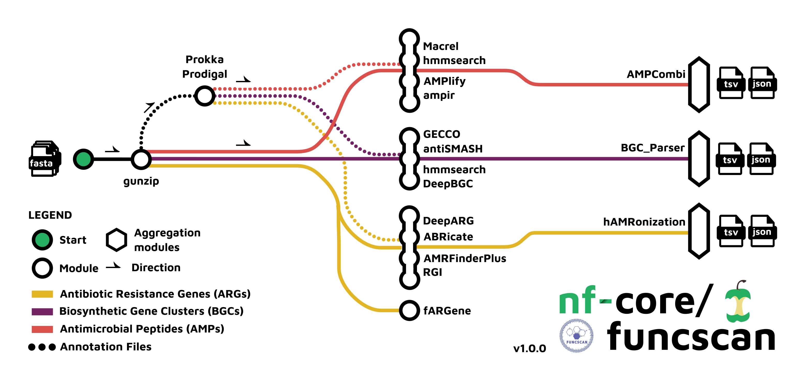

#  

[](https://github.com/nf-core/funcscan/actions?query=workflow%3A%22nf-core+CI%22)
[](https://github.com/nf-core/funcscan/actions?query=workflow%3A%22nf-core+linting%22)[](https://nf-co.re/funcscan/results)[](https://doi.org/10.5281/zenodo.XXXXXXX)

[](https://nf-co.re/funcscan/results)[](https://doi.org/10.5281/zenodo.7643099)
[](https://www.nextflow.io/)

[](https://docs.conda.io/en/latest/)
[](https://www.docker.com/)
[](https://sylabs.io/docs/)
[](https://tower.nf/launch?pipeline=https://github.com/nf-core/funcscan)

[](https://nfcore.slack.com/channels/funcscan)[](https://twitter.com/nf_core)[](https://mstdn.science/@nf_core)[](https://www.youtube.com/c/nf-core)

## Introduction

**nf-core/funcscan** is a bioinformatics best-practice analysis pipeline for the screening of nucleotide sequences such as assembled contigs for functional genes. It currently features mining for antimicrobial peptides, antibiotic resistance genes and biosynthetic gene clusters.

The pipeline is built using [Nextflow](https://www.nextflow.io), a workflow tool to run tasks across multiple compute infrastructures in a very portable manner. It uses Docker/Singularity containers making installation trivial and results highly reproducible. The [Nextflow DSL2](https://www.nextflow.io/docs/latest/dsl2.html) implementation of this pipeline uses one container per process which makes it much easier to maintain and update software dependencies. Where possible, these processes have been submitted to and installed from [nf-core/modules](https://github.com/nf-core/modules) in order to make them available to all nf-core pipelines, and to everyone within the Nextflow community!

On release, automated continuous integration tests run the pipeline on a full-sized dataset on the AWS cloud infrastructure. This ensures that the pipeline runs on AWS, has sensible resource allocation defaults set to run on real-world datasets, and permits the persistent storage of results to benchmark between pipeline releases and other analysis sources. The results obtained from the full-sized test can be viewed on the [nf-core website](https://nf-co.re/funcscan/results).

The nf-core/funcscan AWS full test dataset are contigs generated by the MGnify service from the ENA. We used contigs generated from assemblies of chicken cecum shotgun metagenomes (study accession: MGYS00005631).

## Pipeline summary

1. Annotation of assembled prokaryotic contigs with [`Prodigal`](https://github.com/hyattpd/Prodigal), [`Pyrodigal`](https://github.com/althonos/pyrodigal), [`Prokka`](https://github.com/tseemann/prokka), or [`Bakta`](https://github.com/oschwengers/bakta)
2. Screening contigs for antimicrobial peptide-like sequences with [`ampir`](https://cran.r-project.org/web/packages/ampir/index.html), [`Macrel`](https://github.com/BigDataBiology/macrel), [`HMMER`](http://hmmer.org/), [`AMPlify`](https://github.com/bcgsc/AMPlify)
3. Screening contigs for antibiotic resistant gene-like sequences with [`ABRicate`](https://github.com/tseemann/abricate), [`AMRFinderPlus`](https://github.com/ncbi/amr), [`fARGene`](https://github.com/fannyhb/fargene), [`RGI`](https://card.mcmaster.ca/analyze/rgi), [`DeepARG`](https://bench.cs.vt.edu/deeparg)
4. Screening contigs for biosynthetic gene cluster-like sequences with [`antiSMASH`](https://antismash.secondarymetabolites.org), [`DeepBGC`](https://github.com/Merck/deepbgc), [`GECCO`](https://gecco.embl.de/), [`HMMER`](http://hmmer.org/)
5. Creating aggregated reports for all samples across the workflows with [`AMPcombi`](https://github.com/Darcy220606/AMPcombi) for AMPs, [`hAMRonization`](https://github.com/pha4ge/hAMRonization) for ARGs, and [`comBGC`](https://raw.githubusercontent.com/nf-core/funcscan/master/bin/comBGC.py) for BGCs
6. Software version and methods text reporting with [`MultiQC`](http://multiqc.info/)



## Usage

:::note
If you are new to Nextflow and nf-core, please refer to [this page](https://nf-co.re/docs/usage/installation) on how
to set-up Nextflow. Make sure to [test your setup](https://nf-co.re/docs/usage/introduction#how-to-run-a-pipeline)
with `-profile test` before running the workflow on actual data.
:::

First, prepare a samplesheet with your input data that looks as follows:

`samplesheet.csv`:

```csv
sample,fasta
CONTROL_REP1,AEG588A1_001.fasta
CONTROL_REP2,AEG588A1_002.fasta
CONTROL_REP3,AEG588A1_003.fasta
```

Each row represents a (multi-)fasta file of assembled contig sequences.

Now, you can run the pipeline using:

```bash
nextflow run nf-core/funcscan \
   -profile <docker/singularity/podman/shifter/charliecloud/conda/institute> \
   --input samplesheet.csv \
   --outdir <OUTDIR> \
   --run_amp_screening \
   --run_arg_screening \
   --run_bgc_screening
```

:::warning
Please provide pipeline parameters via the CLI or Nextflow `-params-file` option. Custom config files including those
provided by the `-c` Nextflow option can be used to provide any configuration _**except for parameters**_;
see [docs](https://nf-co.re/usage/configuration#custom-configuration-files).
:::

For more details and further functionality, please refer to the [usage documentation](https://nf-co.re/funcscan/usage) and the [parameter documentation](https://nf-co.re/funcscan/parameters).

## Pipeline output

To see the results of an example test run with a full size dataset refer to the [results](https://nf-co.re/funcscan/results) tab on the nf-core website pipeline page.
For more details about the output files and reports, please refer to the
[output documentation](https://nf-co.re/funcscan/output).

## Credits

nf-core/funcscan was originally written by Jasmin Frangenberg, Anan Ibrahim, Louisa Perelo, Moritz E. Beber, James A. Fellows Yates.

We thank the following people for their extensive assistance in the development of this pipeline:

Rosa Herbst, Martin Klapper.

## Contributions and Support

If you would like to contribute to this pipeline, please see the [contributing guidelines](.github/CONTRIBUTING.md).

For further information or help, don't hesitate to get in touch on the [Slack `#funcscan` channel](https://nfcore.slack.com/channels/funcscan) (you can join with [this invite](https://nf-co.re/join/slack)).

## Citations

If you use nf-core/funcscan for your analysis, please cite it using the following doi: [10.5281/zenodo.7643099](https://doi.org/10.5281/zenodo.7643099)

An extensive list of references for the tools used by the pipeline can be found in the [`CITATIONS.md`](CITATIONS.md) file.

You can cite the `nf-core` publication as follows:

> **The nf-core framework for community-curated bioinformatics pipelines.**
>
> Philip Ewels, Alexander Peltzer, Sven Fillinger, Harshil Patel, Johannes Alneberg, Andreas Wilm, Maxime Ulysse Garcia, Paolo Di Tommaso & Sven Nahnsen.
>
> _Nat Biotechnol._ 2020 Feb 13. doi: [10.1038/s41587-020-0439-x](https://dx.doi.org/10.1038/s41587-020-0439-x).
